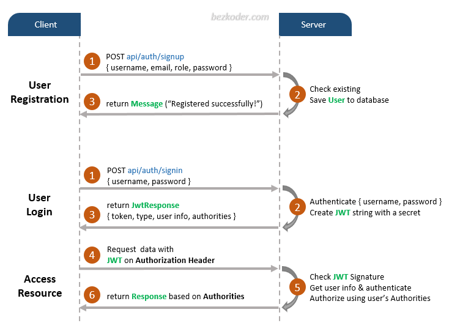

# Spring Boot JWT Authentication example with Spring Security & Spring Data JPA

## Web Security 101
Before you become a Spring Security Guru, you need to understand three important concepts:
1.	Authentication
2.	Authorization
3.	Servlet Filters

### 1. Authentication
First off, if you are running a typical (web) application, you need your users to authenticate. That means your application needs to verify if the user is who he claims to be, typically done with a username and password check.

**User**: "I’m the president of the United States. My username is: potus!"

**Your webapp**: "Sure sure, what’s your password then, Mr. President?"

**User**: "My password is: th3don4ld".

**Your webapp**: "Correct. Welcome, Sir!"

### 2. Authorization
In simpler applications, authentication might be enough: As soon as a user authenticates, she can access every part of an application.

But most applications have the concept of permissions (or roles). Imagine: customers who have access to the public-facing frontend of your webshop, and administrators who have access to a separate admin area.

Both type of users need to login, but the mere fact of authentication doesn’t say anything about what they are allowed to do in your system. Hence, you also need to check the permissions of an authenticated user, i.e. you need to authorize the user.

**User**: "Let me play with that nuclear football…."

**Your webapp**: "One second, I need to check your permissions first…..yes Mr. President, you have the right clearance level. Enjoy."

**User**: "What was that red button again…??"

### 3. Servlet Filters
Java **Servlets** are the Java programs that run on the Java-enabled web server or application server. They are used to handle the request obtained from the web server, process the request, produce the response, and then send a response back to the web server.

Java Servlet is part of Java web architecture (called J2EE). Spring Web is built on top of J2EE framework. Java Servlet is hidden behind the Spring web framework. Developers are not handling Java Servlet directly, but will use the associated classes, such as **HttpServlet**, etc. In old days, developers directly handle Java Servlet via J2EE framework.

Last but not least, let’s have a look at Servlet Filters. What do they have to do with authentication and authorization? (If you are completely new to Java Servlets or Filters, I advise you to read the old, but still very valid [Head First Servlets](http://shop.oreilly.com/product/9780596005405.do) book.)

**Why use Servlet Filters?**

Basically any Spring web application is just one servlet: Spring’s good old DispatcherServlet, that redirects incoming HTTP requests (e.g. from a browser) to your @Controllers or @RestControllers.

The thing is: There is no security hardcoded into that [DispatcherServlet](https://docs.spring.io/spring-framework/reference/web/webmvc/mvc-servlet.html) and you also very likely don’t want to fumble around with a raw HTTP Basic Auth header in your @Controllers. Optimally, the authentication and authorization should be done before a request hits your @Controllers.

Luckily, there’s a way to do exactly this in the Java web world: you can put filters in front of servlets, which means you could think about writing a SecurityFilter and configure it in your Tomcat (servlet container/application server) to filter every incoming HTTP request before it hits your servlet.


**A naive SecurityFilter**

A SecurityFilter has roughly 4 tasks and a naive and overly-simplified implementation could look like this:
```
import javax.servlet.*;
import javax.servlet.http.HttpFilter;
import javax.servlet.http.HttpServletRequest;
import javax.servlet.http.HttpServletResponse;
import java.io.IOException;

public class SecurityServletFilter extends HttpFilter {

    @Override
    protected void doFilter(HttpServletRequest request, HttpServletResponse response, FilterChain chain) throws IOException, ServletException {

        UsernamePasswordToken token = extractUsernameAndPasswordFrom(request);  // (1)

        if (notAuthenticated(token)) {  // (2)
            // either no or wrong username/password
            // unfortunately the HTTP status code is called "unauthorized", instead of "unauthenticated"
            response.setStatus(HttpServletResponse.SC_UNAUTHORIZED); // HTTP 401.
            return;
        }

        if (notAuthorized(token, request)) { // (3)
            // you are logged in, but don't have the proper rights
            response.setStatus(HttpServletResponse.SC_FORBIDDEN); // HTTP 403
            return;
        }

        // allow the HttpRequest to go to Spring's DispatcherServlet
        // and @RestControllers/@Controllers.
        chain.doFilter(request, response); // (4)
    }

    private UsernamePasswordToken extractUsernameAndPasswordFrom(HttpServletRequest request) {
        // Either try and read in a Basic Auth HTTP Header, which comes in the form of user:password
        // Or try and find form login request parameters or POST bodies, i.e. "username=me" & "password="myPass"
        return checkVariousLoginOptions(request);
    }


    private boolean notAuthenticated(UsernamePasswordToken token) {
        // compare the token with what you have in your database...or in-memory...or in LDAP...
        return false;
    }

    private boolean notAuthorized(UsernamePasswordToken token, HttpServletRequest request) {
       // check if currently authenticated user has the permission/role to access this request's /URI
       // e.g. /admin needs a ROLE_ADMIN , /callcenter needs ROLE_CALLCENTER, etc.
       return false;
    }
}
```
1.	First, the filter needs to extract a username/password from the request. It could be via a [Basic Auth HTTP Header](https://en.wikipedia.org/wiki/Basic_access_authentication), or form fields, or a cookie, etc.

2.	Then the filter needs to validate that username/password combination against something, like a database.

3.	The filter needs to check, after successful authentication, that the user is authorized to access the requested URI.

4.	If the request survives all these checks, then the filter can let the request go through to your DispatcherServlet, i.e. your @Controllers.

**FilterChains**

Reality Check: While the above code compiles, it would sooner or later lead to one monster filter with a ton of code for various authentication and authorization mechanisms.

In the real-world, however, you would split this one filter up into multiple filters, that you then chain together.

For example, an incoming HTTP request would…

1.	First, go through a LoginMethodFilter…

2.	Then, go through an AuthenticationFilter…

3.	Then, go through an AuthorizationFilter…

4.	Finally, hit your servlet.

This concept is called **FilterChain** and the last method call in your filter above is actually delegating to that very chain:
```chain.doFilter(request, response);```

With such a filter (chain) you can basically handle every authentication or authorization problem there is in your application, without needing to change your actual application implementation (think: your @RestControllers / @Controllers).
Armed with that knowledge, let’s find out how Spring Security makes use of this filter magic.

We’ll start covering Spring Security a bit unconventionally, by going in the reverse direction from the previous chapter, starting with Spring Security’s FilterChain.

**Spring’s DefaultSecurityFilterChain**

Let’s assume you set up Spring Security correctly and then boot up your web application. You’ll see the following log message:

```
2020-02-25 10:24:27.875  INFO 11116 --- [           main] o.s.s.web.DefaultSecurityFilterChain     : Creating filter chain: any request, [org.springframework.security.web.context.request.async.WebAsyncManagerIntegrationFilter@46320c9a, org.springframework.security.web.context.SecurityContextPersistenceFilter@4d98e41b, org.springframework.security.web.header.HeaderWriterFilter@52bd9a27, org.springframework.security.web.csrf.CsrfFilter@51c65a43, org.springframework.security.web.authentication.logout.LogoutFilter@124d26ba, org.springframework.security.web.authentication.UsernamePasswordAuthenticationFilter@61e86192, org.springframework.security.web.authentication.ui.DefaultLoginPageGeneratingFilter@10980560, org.springframework.security.web.authentication.ui.DefaultLogoutPageGeneratingFilter@32256e68, org.springframework.security.web.authentication.www.BasicAuthenticationFilter@52d0f583, org.springframework.security.web.savedrequest.RequestCacheAwareFilter@5696c927, org.springframework.security.web.servletapi.SecurityContextHolderAwareRequestFilter@5f025000, org.springframework.security.web.authentication.AnonymousAuthenticationFilter@5e7abaf7, org.springframework.security.web.session.SessionManagementFilter@681c0ae6, org.springframework.security.web.access.ExceptionTranslationFilter@15639d09, org.springframework.security.web.access.intercept.FilterSecurityInterceptor@4f7be6c8]|
```
If you expand that one line into a list, it looks like Spring Security does not just install one filter, instead it installs a whole filter chain consisting of 15 (!) different filters.

So, when an HTTPRequest comes in, it will go through all these 15 filters, before your request finally hits your @RestControllers. The order is important, too, starting at the top of that list and going down to the bottom.


**Analyzing Spring’s FilterChain**

It would go too far to have a detailed look at every filter of this chain, but here’s the explanations for a few of those filters. Feel free to look at [Spring Security’s source code](https://github.com/spring-projects/spring-security) to understand the other filters.

* **BasicAuthenticationFilter**: Tries to find a Basic Auth HTTP Header on the request and if found, tries to authenticate the user with the header’s username and password.

* **UsernamePasswordAuthenticationFilter**: Tries to find a username/password request parameter/POST body and if found, tries to authenticate the user with those values.

* **DefaultLoginPageGeneratingFilter**: Generates a login page for you, if you don’t explicitly disable that feature. THIS filter is why you get a default login page when enabling Spring Security.

* **DefaultLogoutPageGeneratingFilter**: Generates a logout page for you, if you don’t explicitly disable that feature.

* **FilterSecurityInterceptor**: Does your authorization.

So with these couple of filters, Spring Security provides you a login/logout page, as well as the ability to login with Basic Auth or Form Logins, as well as a couple of additional goodies like the CsrfFilter, that we are going to have a look at later.


## REST APIs
In this Spring Boot project, the following APIs are available for various users/roles.

|Methods	|Urls	              |Actions|
|---------|-------------------|--------|
|POST	    |/api/auth/signup	  |signup new account|
|POST	    |/api/auth/signin	  |login an account|
|GET	    |/api/test/all	    |retrieve public content|
|GET	    |/api/test/user	    |access User’s content|
|GET	    |/api/test/mod	    |access Moderator’s content|
|GET	    |/api/test/admin	  |access Admin’s content|

They are controlled by Spring Security for access (to be explained later).

## User Registration, User Login and Authorization process.
The diagram shows flow of how we implement User Registration, User Login and Authorization process.



## Spring Boot Server Architecture with Spring Security
You can have an overview of our Spring Boot Server with the diagram below:


## Dependency
- To enable Spring Security:
```xml
<dependency>
  <groupId>org.springframework.boot</groupId>
  <artifactId>spring-boot-starter-security</artifactId>
</dependency>
<dependency>
  <groupId>org.springframework.security</groupId>
  <artifactId>spring-security-core</artifactId>
</dependency>
<dependency>
  <groupId>org.springframework.security</groupId>
  <artifactId>spring-security-test</artifactId>
  <scope>test</scope>
</dependency>
```
"spring-security-test" is for writing testing codes.

- JWT packages for generating and validating JWT tokens:
```xml
<dependency>
  <groupId>io.jsonwebtoken</groupId>
  <artifactId>jjwt-api</artifactId>
  <version>0.11.5</version>
</dependency>
<dependency>
  <groupId>io.jsonwebtoken</groupId>
  <artifactId>jjwt-impl</artifactId>
  <version>0.11.5</version>
  <scope>runtime</scope>
</dependency>
<dependency>
  <groupId>io.jsonwebtoken</groupId>
  <artifactId>jjwt-jackson</artifactId>
  <version>0.11.5</version>
  <scope>runtime</scope>
</dependency>
```

## Configure Spring Datasource, JPA, App properties
Open `src/main/resources/application.properties`

- For MySQL
```
spring.datasource.url=jdbc:mysql://localhost:3306/testdb_spring?useSSL=false
spring.datasource.username=root
spring.datasource.password=123456

spring.jpa.properties.hibernate.dialect=org.hibernate.dialect.MySQLDialect
spring.jpa.hibernate.ddl-auto=update

# App Properties
bezkoder.app.jwtSecret= ======================BezKoder=Spring===========================
bezkoder.app.jwtExpirationMs=86400000
```
The last two items will be used in JWT related classes, and will be explained later.

## Run Spring Boot application
```
mvn spring-boot:run
```

## Run following SQL insert statements
The following SQL commands nned to be executed because the application assumes the "roles" table has been populated.

```
INSERT INTO roles(name) VALUES('ROLE_USER');
INSERT INTO roles(name) VALUES('ROLE_MODERATOR');
INSERT INTO roles(name) VALUES('ROLE_ADMIN');
```
These SQL statements can be put in "resources\import.sql", which will be loaded when the Spring application is run.

## Spring Security
– *WebSecurityConfig* is the crux of our security implementation. It configures cors, csrf, session management, rules for protected resources. We can also extend and customize the default configuration that contains the elements below.
(*WebSecurityConfigurerAdapter* is deprecated from Spring 2.7.0, you can check the source code for update.)

– *UserDetailsService* interface has a method to load User by username and returns a ```UserDetails``` object that Spring Security can use for authentication and validation.

– *UserDetails* contains necessary information (such as: username, password, authorities) to build an ```Authentication``` object.

– *UsernamePasswordAuthenticationToken* gets ```{username, password}``` from login ```Request```, ```AuthenticationManager``` will use it to authenticate a login account.

– *AuthenticationManager* has a ```DaoAuthenticationProvider``` (with help of ```UserDetailsService``` & ```PasswordEncoder```) to validate ```UsernamePasswordAuthenticationToken``` object. If successful, ```AuthenticationManager``` returns a fully populated ```Authentication``` object (including granted authorities).

– *OncePerRequestFilter* makes a single execution for each request to our API. It provides a ```doFilterInternal()``` method that we will implement parsing & validating JWT, loading User details (using ```UserDetailsService```), checking Authorizaion (using ```UsernamePasswordAuthenticationToken```).

– *AuthenticationEntryPoint* will catch authentication error.

Repository contains ```UserRepository``` & ```RoleRepository``` to work with Database, will be imported into Controller.

Controller receives and handles request after it was filtered by ```OncePerRequestFilter```. For this project, the following controllers are defined.

– *AuthController* handles signup/login requests

– *TestController* has accessing protected resource methods with role based validations.

## How to configure Spring Security

### Step 1: Create Models

* ```User```: This is for storing user information (username, password, email, roles), which is mapped to the database table, "users". It is defined in User.java.
* ```Role``` and ```ERole```: defines "role" for users.

There are also several helper classes that contains data for response and request. They are under the folder, "payload". These front end request/response data structures need to match these data structures.

* payload/request:
  - ```LoginRequest```: stores login request data (username, password).
  - ```SignupRequest```: stores signup request data (username, password, role, email)).
* payload/response:
  - ```JwtResponse```: stores JWT response information: token, token type, id, username, email, role.
  - ```MessageRespopnse```: stores message.

### Step 2: Create Repositories

Repositories are for accessing database with the defined models. Hence, two repositories need to be defined.
* ```UserRepository```: for ```User```.
* ```RoleRepository```: for ```Role```.

### Step 3: Configure Spring Security

In this example, the Spring Security configuration class is located in folder, "security". It can be put in any folder.

The class definition is shown as follow:
```
@Configuration
@EnableWebSecurity
public class WebSecurityConfig { // 1.
  @Autowired
  UserDetailsServiceImpl userDetailsService; // 2.

  @Autowired
  private AuthEntryPointJwt unauthorizedHandler;

  @Bean
  public AuthTokenFilter authenticationJwtTokenFilter() { // 3.
    return new AuthTokenFilter();
  }
  
  @Bean
  public AuthenticationProvider authenticationProvider() { // 4.
      DaoAuthenticationProvider authProvider = new DaoAuthenticationProvider();
       
      authProvider.setUserDetailsService(userDetailsService);
      authProvider.setPasswordEncoder(passwordEncoder());
   
      return authProvider;
  }

  // 5. 
  @Bean
  public AuthenticationManager authenticationManager(AuthenticationConfiguration authConfig) throws Exception {
    return authConfig.getAuthenticationManager();
  }

  // 6.
  @Bean
  public PasswordEncoder passwordEncoder() {
    return new BCryptPasswordEncoder();
  }
  
  // 7.
  @Bean
  public SecurityFilterChain filterChain(HttpSecurity http) throws Exception {
    http.csrf(csrf -> csrf.disable())
        .exceptionHandling(exception -> exception.authenticationEntryPoint(unauthorizedHandler))
        .sessionManagement(session -> session.sessionCreationPolicy(SessionCreationPolicy.STATELESS))
        .authorizeHttpRequests(auth -> 
          auth.requestMatchers("/api/auth/**").permitAll()
              .requestMatchers("/api/test/**").permitAll()
              .anyRequest().authenticated()
        );
    
    http.authenticationProvider(authenticationProvider());

    http.addFilterBefore(authenticationJwtTokenFilter(), UsernamePasswordAuthenticationFilter.class);
    
    return http.build();
  }
}
```

Let's explain each essential elements of the configurations:

1. Define a class, ```WebSecurityConfig``` and annotate it with ```@Configuration``` and ```@EnableWebSecurity```.
2. Inject ```UserDetailsService``` for accessing ```UserDetails```, needed for authentication. This example also inject ```AuthEntryPointJwt``` for exception handling, which is not required, but optional for this specific implementation.
3. Create a bean of ```AuthTokenFilter```, which creates and validates JWT tokens. This filter is added to the filter chain.
4. Create a bean of ```AuthenticationProvider```. Within this provider, it sets UserDetailsService and PasswordEncoder. The authentication provider will use UserDetailsService to get User details and use PasswordEncoder to validate the password provided during login request.
5. Create a bean of ```AuthenticationManager```. 
6. Create a bean of ```PasswordEncoder```. The password encoder is used to encode the password provided in the login request. The encoded password is then compare with what is stored in the database (via ```UserDetailsService```).
7. Create a bean of ```SecurityFilterChain```. Here are detailed explainations.
    * ```SecurityFilterChain``` has one argument, ```HttpSecurity```, and throws an Expeception.
    * It constructs a security filter chain:
      - csrf()
      - exceptionHandling()
      - sessionManagement()
      - authorizeHttpRequests(): within it, defines series of URL rules. ```permitAll()``` means it can be access without authentication. ```authenticated``` mean the access needs to be authenticated.
    * set ```AuthenticationProvider```.
    * add ```AuthTokenFilter``` before ```UsernamePasswordAutheticationFilter```..
    * build the filter chain by calling ```build()```.

### Step 4: Implement UserDetails & UserDetailsService
In the above codes, ```UserDetails``` and ```UserDetailsService``` are used in the Security Configuration. They nned to defined.

**UserDetails**
Even though ```User``` is defined as a model and mapped to a database table, ```UserDetails``` is a class used in Spring authentication filter.

Typically, ```UserDetails``` can be constructed from ```User``` class. Only username, password and role are useful for authentication. Other user information is not needed. The ```UserDetails``` class implements the interface, ```UserDetails```.

**UserDetailsService**
A service is defined and implements ```UserDetailsService``` (to implement ```loadUserByUsername()```). Its main function is to load the user information from database and construct a class of ```UserDetails```.

## Step 5: Define AuthTokenFilter
In this class, two beans are injected: a helper class to deal with JWT, and a ```UserDetailsService``` for access user information. The filter extends ```OncePerRequestFilter``` interface.

The most important thing in the filter is to implement ```doFilterInternal*()```.
* It has three arguments: HttpServletRequest request, HttpServletResponse response, FilterChain filterChain.
* from the request, JWT token is extracted by ```parseJwt()```. It gets JWT from the Authorization header (by removing Bearer prefix)
* if the request has JWT, validate it, parse username from it
* from username, get ```UserDetails``` to create an ```Authentication``` object
* set the current ```UserDetails``` in ```SecurityContext``` using ```setAuthentication(authentication)``` method.

## Step 6: Define JWT helper class, ```JwtUtils```
This class has 3 funtions:
* generate a JWT from username, date, expiration, secret
* get username from JWT
* validate a JWT

In the above function, ```Jwts``` package is used to simply JWT related functions.
* ```Jwts.builder()``` is used to generate an JWT token.
* ```Jwts.parseBuilder()``` is used to parse a JWT token, by setting the secrete key to validate the JWT token. Then user information can be extracted.

## Step 7: User Signup
User signup is required to set up user account and associated permissions (or roles). A RestController route, ```/api/auth/sigup``` is set up for this purpose.

It works as follow.
* When the URL is accessed, the POST action provides the user information in ```SignupRTequest```.
* Use ```UserRepository``` to determine if the specific user already exists. If yes, return error messages. Otherwise, continue.
* Construct a ```User``` class and encode the password by ```PasswordEncoder```. Set up roles. Call to save the user info and Role to the database.

## Step 8: User Signin
User signin is done via ```/api/auth/signin```, a POST route. It works as follow.
* Receive POST data via ```LoginRequest```.
* Extract the username and password. Contract an ```Authentication``` object by calling ```AuthenticationManager.authenticate()``` with the username and password.
* Set the ```Autrhentication``` object to the ```SecurityContect```.
* Generate a JWT token from the  ```authentication``` object.
* Construct a ```JwtResponse``` object and return.


For more detail, please visit:
> [Secure Spring Boot with Spring Security & JWT Authentication](https://bezkoder.com/spring-boot-jwt-authentication/)

> [For MongoDB](https://bezkoder.com/spring-boot-jwt-auth-mongodb/)

## Refresh Token


For instruction: [Spring Boot Refresh Token with JWT example](https://bezkoder.com/spring-boot-refresh-token-jwt/)

## More Practice:
> [Spring Boot JWT Authentication example using HttpOnly Cookie](https://www.bezkoder.com/spring-boot-login-example-mysql/)

> [Spring Boot File upload example with Multipart File](https://bezkoder.com/spring-boot-file-upload/)

> [Exception handling: @RestControllerAdvice example in Spring Boot](https://bezkoder.com/spring-boot-restcontrolleradvice/)

> [Spring Boot Repository Unit Test with @DataJpaTest](https://bezkoder.com/spring-boot-unit-test-jpa-repo-datajpatest/)

> [Spring Boot Pagination & Sorting example](https://www.bezkoder.com/spring-boot-pagination-sorting-example/)

> Validation: [Spring Boot Validate Request Body](https://www.bezkoder.com/spring-boot-validate-request-body/)

> Documentation: [Spring Boot and Swagger 3 example](https://www.bezkoder.com/spring-boot-swagger-3/)

> Caching: [Spring Boot Redis Cache example](https://www.bezkoder.com/spring-boot-redis-cache-example/)

Associations:
> [Spring Boot One To Many example with Spring JPA, Hibernate](https://www.bezkoder.com/jpa-one-to-many/)

> [Spring Boot Many To Many example with Spring JPA, Hibernate](https://www.bezkoder.com/jpa-many-to-many/)

> [JPA One To One example with Spring Boot](https://www.bezkoder.com/jpa-one-to-one/)

Deployment:
> [Deploy Spring Boot App on AWS – Elastic Beanstalk](https://www.bezkoder.com/deploy-spring-boot-aws-eb/)

> [Docker Compose Spring Boot and MySQL example](https://www.bezkoder.com/docker-compose-spring-boot-mysql/)

## Fullstack Authentication

> [Spring Boot + Vue.js JWT Authentication](https://bezkoder.com/spring-boot-vue-js-authentication-jwt-spring-security/)

> [Spring Boot + Angular 8 JWT Authentication](https://bezkoder.com/angular-spring-boot-jwt-auth/)

> [Spring Boot + Angular 10 JWT Authentication](https://bezkoder.com/angular-10-spring-boot-jwt-auth/)

> [Spring Boot + Angular 11 JWT Authentication](https://bezkoder.com/angular-11-spring-boot-jwt-auth/)

> [Spring Boot + Angular 12 JWT Authentication](https://www.bezkoder.com/angular-12-spring-boot-jwt-auth/)

> [Spring Boot + Angular 13 JWT Authentication](https://www.bezkoder.com/angular-13-spring-boot-jwt-auth/)

> [Spring Boot + Angular 14 JWT Authentication](https://www.bezkoder.com/angular-14-spring-boot-jwt-auth/)

> [Spring Boot + Angular 15 JWT Authentication](https://www.bezkoder.com/angular-15-spring-boot-jwt-auth/)

> [Spring Boot + Angular 16 JWT Authentication](https://www.bezkoder.com/angular-16-spring-boot-jwt-auth/)

> [Spring Boot + Angular 17 JWT Authentication](https://www.bezkoder.com/angular-17-spring-boot-jwt-auth/)

> [Spring Boot + React JWT Authentication](https://bezkoder.com/spring-boot-react-jwt-auth/)

## Fullstack CRUD App

> [Vue.js + Spring Boot + H2 Embedded database example](https://www.bezkoder.com/spring-boot-vue-js-crud-example/)

> [Vue.js + Spring Boot + MySQL example](https://www.bezkoder.com/spring-boot-vue-js-mysql/)

> [Vue.js + Spring Boot + PostgreSQL example](https://www.bezkoder.com/spring-boot-vue-js-postgresql/)

> [Angular 8 + Spring Boot + Embedded database example](https://www.bezkoder.com/angular-spring-boot-crud/)

> [Angular 8 + Spring Boot + MySQL example](https://bezkoder.com/angular-spring-boot-crud/)

> [Angular 8 + Spring Boot + PostgreSQL example](https://bezkoder.com/angular-spring-boot-postgresql/)

> [Angular 10 + Spring Boot + MySQL example](https://bezkoder.com/angular-10-spring-boot-crud/)

> [Angular 10 + Spring Boot + PostgreSQL example](https://bezkoder.com/angular-10-spring-boot-postgresql/)

> [Angular 11 + Spring Boot + MySQL example](https://bezkoder.com/angular-11-spring-boot-crud/)

> [Angular 11 + Spring Boot + PostgreSQL example](https://bezkoder.com/angular-11-spring-boot-postgresql/)

> [Angular 12 + Spring Boot + Embedded database example](https://www.bezkoder.com/angular-12-spring-boot-crud/)

> [Angular 12 + Spring Boot + MySQL example](https://www.bezkoder.com/angular-12-spring-boot-mysql/)

> [Angular 12 + Spring Boot + PostgreSQL example](https://www.bezkoder.com/angular-12-spring-boot-postgresql/)

> [Angular 13 + Spring Boot + H2 Embedded Database example](https://www.bezkoder.com/spring-boot-angular-13-crud/)

> [Angular 13 + Spring Boot + MySQL example](https://www.bezkoder.com/spring-boot-angular-13-mysql/)

> [Angular 13 + Spring Boot + PostgreSQL example](https://www.bezkoder.com/spring-boot-angular-13-postgresql/)

> [Angular 14 + Spring Boot + H2 Embedded Database example](https://www.bezkoder.com/spring-boot-angular-14-crud/)

> [Angular 14 + Spring Boot + MySQL example](https://www.bezkoder.com/spring-boot-angular-14-mysql/)

> [Angular 14 + Spring Boot + PostgreSQL example](https://www.bezkoder.com/spring-boot-angular-14-postgresql/)

> [Angular 15 + Spring Boot + H2 Embedded Database example](https://www.bezkoder.com/spring-boot-angular-15-crud/)

> [Angular 15 + Spring Boot + MySQL example](https://www.bezkoder.com/spring-boot-angular-15-mysql/)

> [Angular 15 + Spring Boot + PostgreSQL example](https://www.bezkoder.com/spring-boot-angular-15-postgresql/)

> [Angular 16 + Spring Boot + H2 Embedded Database example](https://www.bezkoder.com/spring-boot-angular-16-crud/)

> [Angular 16 + Spring Boot + MySQL example](https://www.bezkoder.com/spring-boot-angular-16-mysql/)

> [Angular 16 + Spring Boot + PostgreSQL example](https://www.bezkoder.com/spring-boot-angular-16-postgresql/)

> [Angular 17 + Spring Boot + H2 Embedded Database example](https://www.bezkoder.com/spring-boot-angular-17-crud/)

> [Angular 17 + Spring Boot + MySQL example](https://www.bezkoder.com/spring-boot-angular-17-mysql/)

> [Angular 17 + Spring Boot + PostgreSQL example](https://www.bezkoder.com/spring-boot-angular-17-postgresql/)

> [React + Spring Boot + MySQL example](https://bezkoder.com/react-spring-boot-crud/)

> [React + Spring Boot + PostgreSQL example](https://bezkoder.com/spring-boot-react-postgresql/)

> [React + Spring Boot + MongoDB example](https://bezkoder.com/react-spring-boot-mongodb/)

Run both Back-end & Front-end in one place:
> [Integrate Angular with Spring Boot Rest API](https://bezkoder.com/integrate-angular-spring-boot/)

> [Integrate React.js with Spring Boot Rest API](https://bezkoder.com/integrate-reactjs-spring-boot/)

> [Integrate Vue.js with Spring Boot Rest API](https://bezkoder.com/integrate-vue-spring-boot/)
